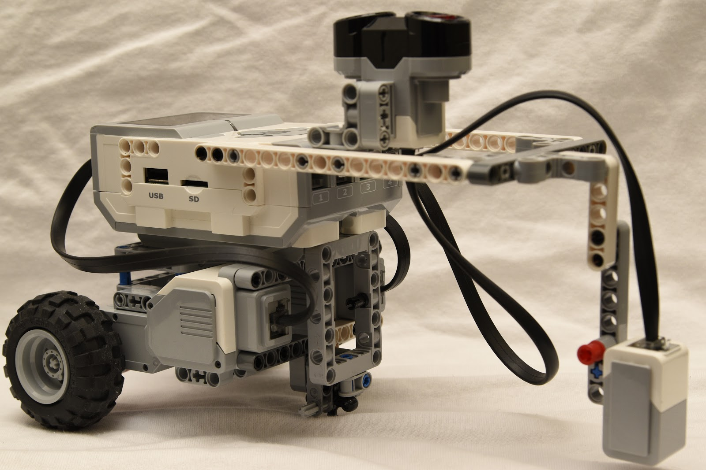

# Bug Robot
This repo showcases the bug robot my team and I developed during my freshman year of college (2017). The robot was built with the LEGO Mindstorms kit and programmed with LabVIEW. The purpose of this project was to create a robot that performed bug-like functions such as detecting danger, hiding, and eating.

## Functions
 * "Hides" from danger via ultrasonic sensor
 * Detects edges and food using color sensor
 * After eating 5 times, stop eating
 * Navigating terrain without falling off edges

## Design

  Front view of the robot, showing the color and ultrasonic sensors responsible for detecting food, boxes, and edges.  
  

  Rear view showing the drivetrain and structure of the robot. This robot has a short and relatively narrow wheelbase that makes it very good at not falling off of tables.
  

